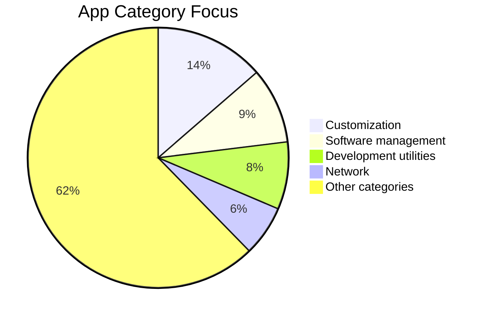

# 🚀 Shizuku Apps - Root Alternative
### User-friendly and AI-friendly catalog of Shizuku-powered Android apps

---

## 📌 Overview

This repository collects **Shizuku-compatible apps** so users can unlock advanced Android features **without root**.

- Works for normal users who want safe system-level control.
- Organized for quick browsing by category.
- Optimized for both humans and AI tools with clear, split pages.
- Ready for community contributions.

---

## 📱 What is Shizuku?

Shizuku lets Android apps call system APIs with elevated privileges via ADB (USB or Wireless Debugging), without rooting your phone.

### How it works (simple flow)

1. Install and start **Shizuku**.
2. Grant permission to supported apps.
3. The app calls privileged system APIs through Shizuku.
4. You get root-like features on non-rooted devices.

---

## ✨ Features of this README update

- ✅ Added a cleaner, easier-to-read layout.
- ✅ Split apps into **different pages by category** for better navigation.
- ✅ Added repository metrics badges:
  - Star count
  - Fork count
  - Watch count
  - View count
- ✅ Added visual graph sections.
- ✅ Added clear contribution-ready section.
- ✅ Added AI Agents category page.

---

## 📚 App Pages (separate pages)

Browse all app categories here:

➡️ **[pages/apps/README.md](pages/apps/README.md)**

Main category pages include:

- [AI agents](pages/apps/ai-agents.md)
- [Android TV](pages/apps/android-tv.md)
- [Audio](pages/apps/audio.md)
- [Automation](pages/apps/automation.md)
- [Communication](pages/apps/communication.md)
- [Customization](pages/apps/customization.md)
- [Development utilities](pages/apps/development-utilities.md)
- [Device owner (DPM)](pages/apps/device-owner-dpm.md)
- [Display management](pages/apps/display-management.md)
- [Entertainment](pages/apps/entertainment.md)
- [File management](pages/apps/file-management.md)
- [Games](pages/apps/games.md)
- [Input methods](pages/apps/input-methods.md)
- [Installer & app stores](pages/apps/installer-app-stores.md)
- [Miscellaneous](pages/apps/miscellaneous.md)
- [Network](pages/apps/network.md)
- [Power management](pages/apps/power-management.md)
- [Privacy](pages/apps/privacy.md)
- [Productivity](pages/apps/productivity.md)
- [Quick settings](pages/apps/quick-settings.md)
- [Software management](pages/apps/software-management.md)
- [Patching](pages/apps/patching.md)
- [Task manager](pages/apps/task-manager.md)
- [Terminals](pages/apps/terminals.md)
- [Vendor-specific](pages/apps/vendor-specific.md)
- [Unlisted apps](pages/apps/unlisted-apps.md)

---

## 📈 Charts

### Star History

### Category Distribution (high-level, snapshot: 2026-06-18)

> Counts are a snapshot of current category pages. To update: manually count app bullet entries in each linked category page and refresh the pie values.

---

## ✅ Ready for Contribution

This project is contribution-ready.

### You can help by:

- Adding new Shizuku-supported apps.
- Improving app descriptions and links.
- Fixing outdated links or metadata.
- Expanding AI agents and emerging categories.

### Contribution steps

1. Fork the repository
2. Edit the matching category page in `pages/apps/`
3. Add app name, link, short description, and license
4. Open a pull request
5. If category app counts change, update the pie-chart snapshot numbers in this README

---

## 🔗 Useful links

- [Shizuku official website](https://shizuku.rikka.app/)
- [Shizuku API docs](https://github.com/RikkaApps/Shizuku-API)
- [Shizuku releases](https://github.com/RikkaApps/Shizuku/releases)
- [Awesome Shizuku upstream reference](https://github.com/timschneeb/awesome-shizuku)

---

If this repo helps you, please ⭐ star and 🔀 share it.

